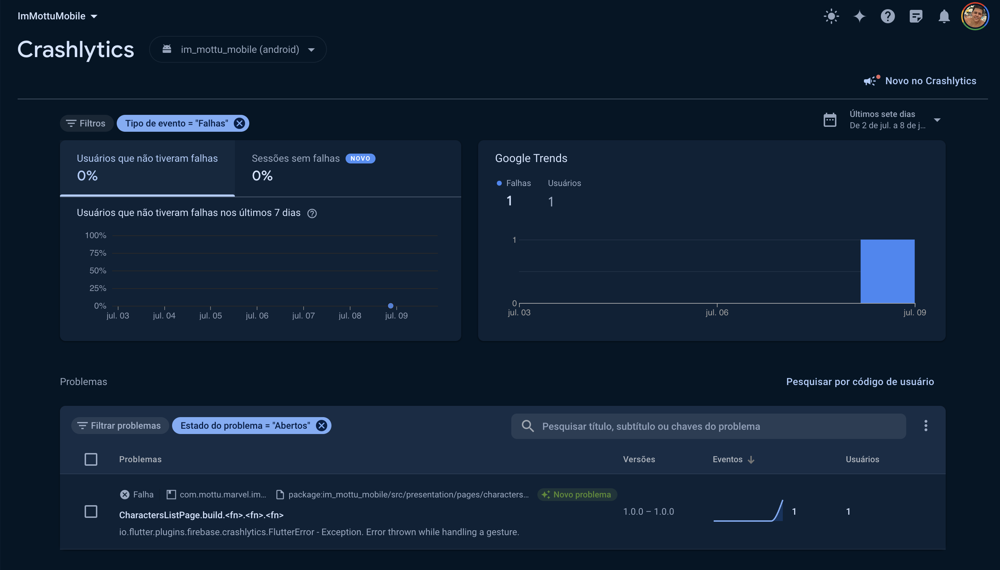

# 🛵 I'm Mottu Mobile 🛵

### Teste prático para desenvolvedores Mobile Mottu


> *Este teste está separado em 3 níveis de dificuldade. Você pode desenvolver seu teste APP atendendo apenas a um nível, ou a todos.*
>
> **Para todos os níveis você deve executar algumas etapas iniciais:**
>- Fazer um **fork** deste repositório para o seu Github, de forma **privada**, e adicionar os usuarios `@brunosmm`, `@BetoMottu`, `@moreirawebmaster`,`@jeanchrocha,` `@astraube`.
>- Criar um projeto Flutter com a seguinte configuração de package: `com.mottu.marvel`.
>- Criar uma conta de desenvolvedor em `developer.marvel.com`.
>- Gerar uma **API KEY** no site de desenvolvedor da **Marvel**, e consumir suas respectivas **API's**.
>- Criar um readme marcando os itens feitos.
>- Buildar para plataforma iOS.
>
> **Sugestões:**
>- Não faça apenas um commit com toda sua implementação.
>- Realize os commits em branchs separadas e utilize PRs.
>- Seja criativo(a) na sua implementação.
>- Não faça **Ctrl+C / Ctrl+V** de outro repositório !!!

# ⚠️ Configuração do Ambiente

Para rodar este aplicativo, é necessário configurar um arquivo `.env` na raiz do projeto com as chaves da API da Marvel. Siga as instruções abaixo para configurar o ambiente:

1. Crie um arquivo chamado `.env` na raiz do projeto.
2. Adicione as seguintes linhas ao arquivo `.env` com suas chaves da API da Marvel:

   ```plaintext
   MARVEL_PUBLIC_KEY=<SUA_MARVEL_PUBLIC_KEY>
   MARVEL_PRIVATE_KEY=<SUA_MARVEL_PRIVATE_KEY>

## Rodando o aplicativo

Para rodar este aplicativo, é necessário configurar um arquivo `.env` na raiz do projeto com as chaves da API da Marvel. Siga as instruções abaixo para configurar o ambiente:

1. Instale as dependências do projeto:
   ```sh
   flutter pub get
1. Execute o aplicativo:
   ```sh
   flutter run

## Rodando os testes
1. Execute o comando:    
    ```sh
    flutter test

# ✔️ NÍVEL 1 - nome da branch (level_1):
- ✔️ Executar etapas iniciais;
- ✔️ Mostrar a listagem dos personagens (imagem e nome);
- ✔️ Ação de clique nos cards da listagem e exibir os detalhes (imagem, nome e descrição);


# ✔️ NÍVEL 2 - nome da branch (level_2):
- ✔️ Executar etapas iniciais;
- ✔️ Guardar em cache as consultas realizadas na API Marvel;
- ✔️ Mostrar a listagem dos personagens (imagem e nome);
- ✔️ Criar um filtro para a listagem;
- ✔️ Ação de clique nos cards da listagem e exibir os detalhes (imagem, nome, descrição e personagens relacionados);


# ✔️ NÍVEL 3 - nome da branch (level_3):
- ✔️ Executar etapas iniciais;
- ✔️ Criar uma Splashscreen customizada;
- ✔️ Guardar em cache as consultas realizadas na API Marvel;
- ✔️ Limpar cache de consultas no fechamento do APP;
- ✔️ Mostrar a listagem dos personagens (imagem e nome);
- ✔️ Criar um filtro para a listagem;
- ✔️ Ciar uma paginação da listagem;
- ✔️ Ação de clique nos cards da listagem e exibir os detalhes (imagem, nome, descrição e personagens relacionados);
- ✔️ Ação de clique nos personagens relacionados e exibir os detalhes (imagem, nome, descrição e personagens relacionados);

> Ao final de cada etapa, criar PR para a branch **main** e realizar o merge.

# ✔️ Pontos extras (opcional):
- ✔️ Utilizar Getx.
- ✔️ Configurar Firebase crashlytics.
- ✔️ Criar channel em kotlin, capturar a mudança de conexão, e mostrar uma mensagem de offline no flutter.


